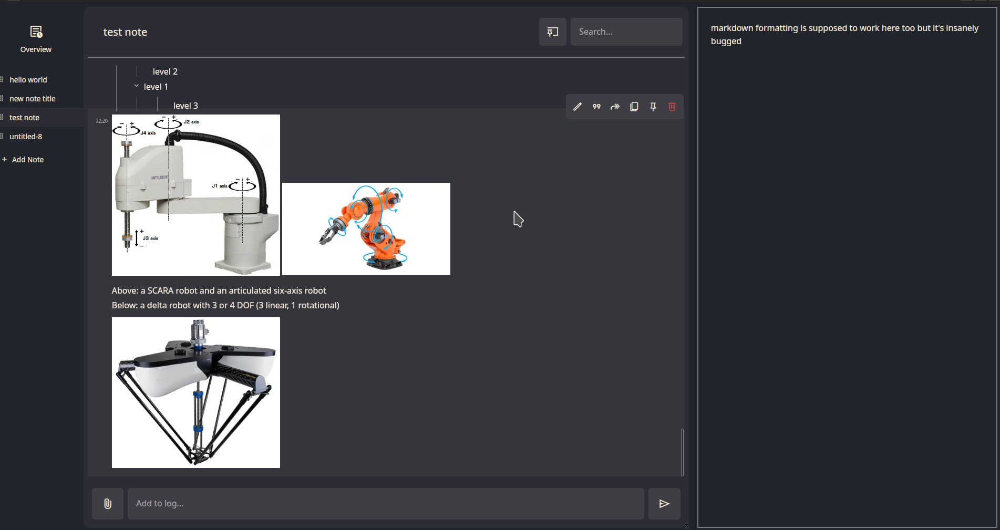
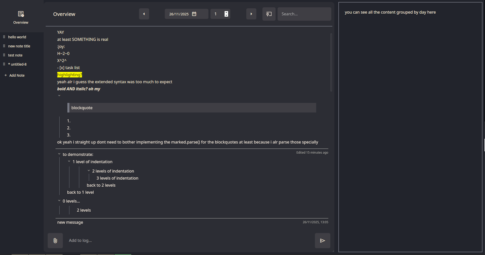

This is a WIP notebook app intended to help organise many many thoughts. I currently keep all my notes in a single, giant text file, but that kinda sucks. 
Making new files for every new idea is just too much work.
I sometimes use Discord for larger projects, but this is laggy and means you have to read through old messages or keep updating a pinned message.

See planned features in Issues.

Too lazy to learn how to use QT/GDK frameworks, so Tauri + TypeScript until I can be bothered moving

* Run with `npm run tauri dev`
* If it complains, try `cargo clean --manifest-path src-tauri/Cargo.toml` first

Screenshots from 28/11/25:

The markdown editor is from https://github.com/jefago/tiny-markdown-editor and I made several modifications to make it work better with my project. This is a really awesome library!